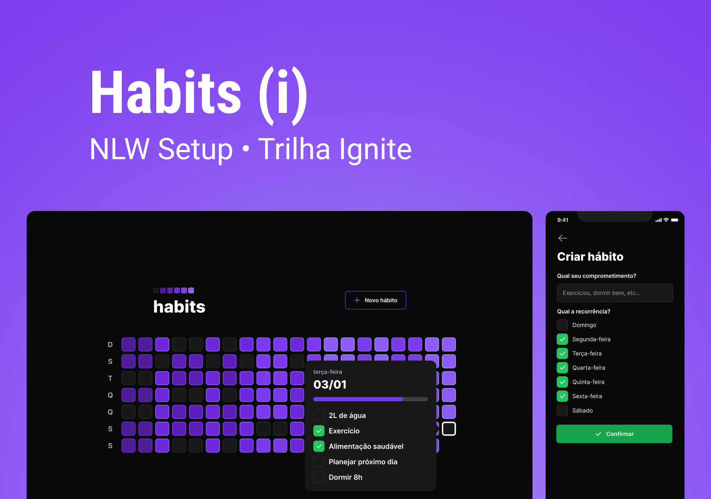

<h1 align="center"> NLW Setup - Habits </h1>

Evento exclusivo e gratuito, promovido pela Rocketseat para ensino de tecnologias WEB.

  <a href="#-tecnologias">Tecnologias</a>&nbsp;&nbsp;&nbsp;|&nbsp;&nbsp;&nbsp;
  <a href="#-projeto">Projeto</a>&nbsp;&nbsp;&nbsp;|&nbsp;&nbsp;&nbsp;
  <a href="#-layout">Layout</a>

  

## 🚀 Tecnologias

Esse projeto foi desenvolvido com as seguintes tecnologias:

- HTML e CSS
- [Node e NPM](https://nodejs.org/)
- [React](https://pt-br.reactjs.org/)
- [React Native](https://pt-br.reactjs.org/)
- [TypeScript](https://www.typescriptlang.org/)
- [Expo](https://www.typescriptlang.org/)
- [Tailwind](https://tailwindcss.com/)

## 💻 Projeto

O projeto habit tracker é uma ferramenta de acompanhamento de hábitos para o usuário colocar em prática suas resoluções e metas, ou seja, registrar ações e acompanhar a evolução dos novos hábitos que deseja colocar na sua rotina.

## 🔖 Layout

Você pode visualizar o layout do projeto através [DESSE LINK](https://www.figma.com/community/file/1195326661124171197). É necessário ter conta no [Figma](https://figma.com) para acessá-lo.

---

Feito no Bootcamp da Rocketseat :wave: [Participe da nossa comunidade!](https://discord.gg/rocketseat)
